# Architectural Flow For Backend API

## Overview

The backend API starts with authentication, then branches into the user-facing areas of the product such as logs, cart, payments, domains, and admin management.

## User Flow

The flow below mirrors the attached journey diagram: it starts with app access, branches on authentication, and then expands into the main product areas.

```mermaid
flowchart LR
    start[User Opens App] --> health[API Init + Health]
    health --> hasAccount{Has Account?}

    hasAccount -->|No| signup[Sign Up]
    signup --> authRecord[Create Auth Record]
    authRecord --> profile[Create User Profile]
    profile --> verify[Send Verify Email]
    verify --> verified[Email Verified]

    hasAccount -->|Yes| login[Login]
    verified --> login
    login --> creds[Verify Credentials]
    creds --> jwt[Issue JWT Session]

    jwt --> loadPrefs[Load Profile + Prefs]
    loadPrefs --> home[Home / Dashboard]

    home --> userMgmt[User Management]
    home --> profileMgmt[Profile Management]
    home --> cart[Cart]
    home --> payments[Payments / Checkout]
    home --> domainMgmt[Domain Management]
    home --> tools[Tool Operations]
    home --> logs[Logs / Activity]

    userMgmt -->|Admin only| manageUsers[List, Create, Soft Delete, Restore]
    userMgmt --> audit[Audit / Support Actions]

    profileMgmt --> viewProfile[View Profile]
    viewProfile --> updateProfile[Update Profile Fields]
    updateProfile --> changePassword[Change Password]
    changePassword --> logout[Logout]

    cart --> editCart[Add / Remove / Update Items]
    editCart --> checkout[Reserve Items for Checkout]
    checkout --> payments

    payments --> initPay[Initialize Payment]
    initPay --> payUrl[Receive Payment URL / Reference]
    payUrl --> webhook[Webhook Processing]
    webhook --> verifySig[Verify HMAC + Deduplicate]
    verifySig --> fulfill[Fulfillment Handlers]
    fulfill --> receipts[Payment History + Receipts]

    domainMgmt --> searchDomain[Check Availability / Pricing]
    searchDomain --> manageDomain[Register / Transfer / Renew]
    manageDomain --> domainSettings[Nameservers / EPP / Lock / Contact]

    tools --> utility[Electricity / Migration / Utility Endpoints]
    utility --> adminTools[Bulk or Admin Tool Operations]

    logs --> viewLogs[View System and Activity Logs]

    receipts --> sessionEnd[Session End]
    logout --> sessionEnd
    domainSettings --> sessionEnd
    adminTools --> sessionEnd
    viewLogs --> sessionEnd

    classDef startEnd fill:#e8f7ff,stroke:#0ea5c3,stroke-width:2px,color:#111827;
    classDef process fill:#ffffff,stroke:#334155,stroke-width:1.5px,color:#111827;
    classDef decision fill:#fff7ed,stroke:#ea580c,stroke-width:2px,color:#111827;

    class start,sessionEnd startEnd;
    class health,signup,authRecord,profile,verify,verified,login,creds,jwt,loadPrefs,home,userMgmt,profileMgmt,cart,payments,domainMgmt,tools,logs,manageUsers,audit,viewProfile,updateProfile,changePassword,logout,editCart,checkout,initPay,payUrl,webhook,verifySig,fulfill,receipts,searchDomain,manageDomain,domainSettings,utility,adminTools,viewLogs process;
    class hasAccount decision;
```

## Bootstrap Sequence

The application starts in `src/main.ts`:

- Creates the Nest application with raw body support enabled.
- Reads `ALLOWED_CORS` and enables CORS for the configured origins.
- Sets the global route prefix to `/api`.
- Enables URI versioning with default version `v1`.
- Applies a global validation pipe with `whitelist: true`.
- Exposes Swagger UI at the root route for API discovery and testing.

## Module Composition

The root module in `src/app.module.ts` assembles the API by importing feature modules:

- `AuthModule` for registration, login, verification, and password reset.
- `UserModule` for user and admin management.
- `DomainModule` for domain lookup, status, nameserver, and contact flows.
- `CartModule` for cart operations.
- `PaymentModule` for checkout and payment processing.
- `ToolModule` for internal tooling and support actions.
- `LogModule` for request or activity logging.
- `HealthModule` for service health checks.

Each feature module keeps the controller, service, DTOs, and any entity access close together so the request path stays predictable.

## Controller To Service Pattern

Controllers are thin and focus on HTTP concerns:

- Parse request bodies, params, and query strings.
- Apply guards where authentication is required.
- Enforce simple role checks when a route is restricted to admin or super admin users.
- Forward validated input to the corresponding service.

Services contain the actual business logic:

- Create, read, update, and delete records.
- Perform ownership and authorization-aware checks.
- Coordinate domain-specific operations such as auth flows, cart updates, payment handling, or domain management.

## Cross-Cutting Concerns

- Authentication is handled with JWT guards on protected routes.
- Request validation is enforced globally through DTOs and the validation pipe.
- Throttling is enabled globally to reduce abuse and accidental traffic spikes.
- Swagger documents the public contract and is generated from controller metadata.
- TypeORM connects the API to PostgreSQL and auto-loads entities from imported modules.

## Example Route Groups

- Public routes: `POST /api/v1/auth/register`, `POST /api/v1/auth/login`, `POST /api/v1/domain/check`
- Protected user routes: `GET /api/v1/user/me`, `PATCH /api/v1/user/me/password`
- Admin routes: `GET /api/v1/user`, `GET /api/v1/domain/all`, `POST /api/v1/domain/lock`

## End-To-End Summary

The backend API is organized so that transport concerns stay in controllers, business rules stay in services, and persistence stays in TypeORM entities backed by PostgreSQL. That separation keeps the request path easy to trace, easier to test, and simpler to extend as new modules are added.
